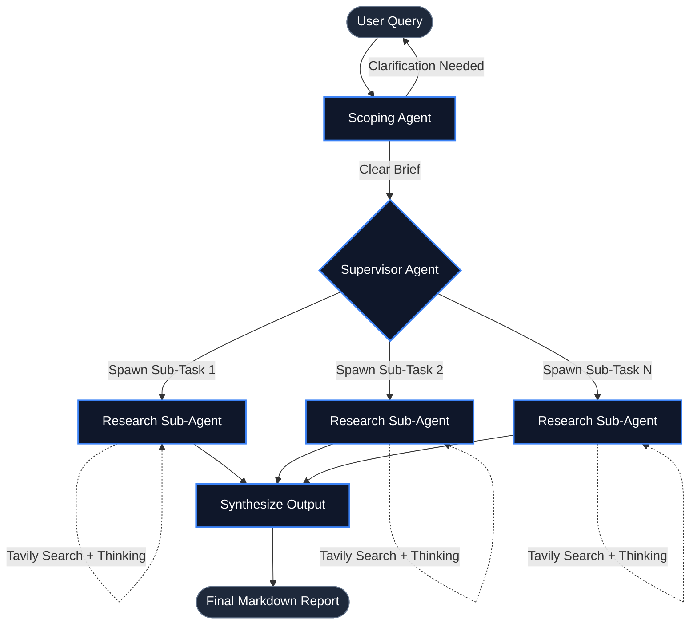

# ⚡ Reisearch: Multi-Agent Deep Research System

Reisearch is a highly autonomous, multi-agent research system built with LangGraph. It takes a vague user query, scopes it, breaks it down into parallel sub-tasks, conducts deep web research, and synthesizes a comprehensive final markdown report.

## 🧠 Architecture Workflow

The system is composed of several specialized agents (LangGraph Subgraphs) that wire together into one "Full Agent" workflow. Everything is designed to run efficiently on **free-tier models (Groq)**.



## 🚀 How to Run

First, ensure your environment variables are set in your `.env` file (`GROQ_API_KEY`, `TAVILY_API_KEY`, `LANGSMITH_API_KEY`). You have three ways to run this system:

### Option 1: Interactive CLI (Premium TUI) 🌟
Experience Reisearch with a beautiful "Claude Code" aesthetic. This mode offers a continuous chat loop, command history, slash commands, and real-time thought streaming.
```bash
uv run python cli.py
```
*Tip: Type `/help` for commands or `/agent full` to run the entire system.*

### Option 2: LangGraph Studio (Visual UI)
LangGraph Studio is a local web UI that lets you chat with your agents, edit their state in real-time, and watch their tool calls visually.
```bash
uvx --refresh --from "langgraph-cli[inmem]" --with-editable . --python 3.11 langgraph dev
```

### Option 3: Terminal Script
For a quick, simple execution without the interactive TUI UI.
```bash
uv run python run.py
```

## 📂 File Structure

| File | Purpose |
|------|---------|
| `cli.py` | Premium interactive Terminal User Interface (TUI) with real-time streaming and slash commands. |
| `run.py` | Simple CLI script to run the scoping agent. |
| `research_agent_scope.py` | **Scoping Agent**: Clarifies vague user prompts and outputs a detailed `research_brief`. |
| `multi_agent_supervisor.py` | **Supervisor Agent**: Uses a thinking tool to parallelize the research brief into sub-tasks for delegation. |
| `research_agent.py` | **Research Sub-Agent**: Performs deep web searches to solve specific research tasks. |
| `research_agent_full.py` | **Full Agent**: The master graph that wires the Scoping, Supervisor, and Research agents together end-to-end. |
| `utils.py` | Utilities for Tavily searching, rate-limit safe content truncation, and model configurations. |
| `prompts.py` | Centralized system prompts for all of the agents. |
| `/info` | Directory containing legacy documentation and deep-dive notes (`understand.md`, `run.md`). |
| `/eval` | Evals and LangSmith benchmarking notebooks for testing the agents deterministically. |
